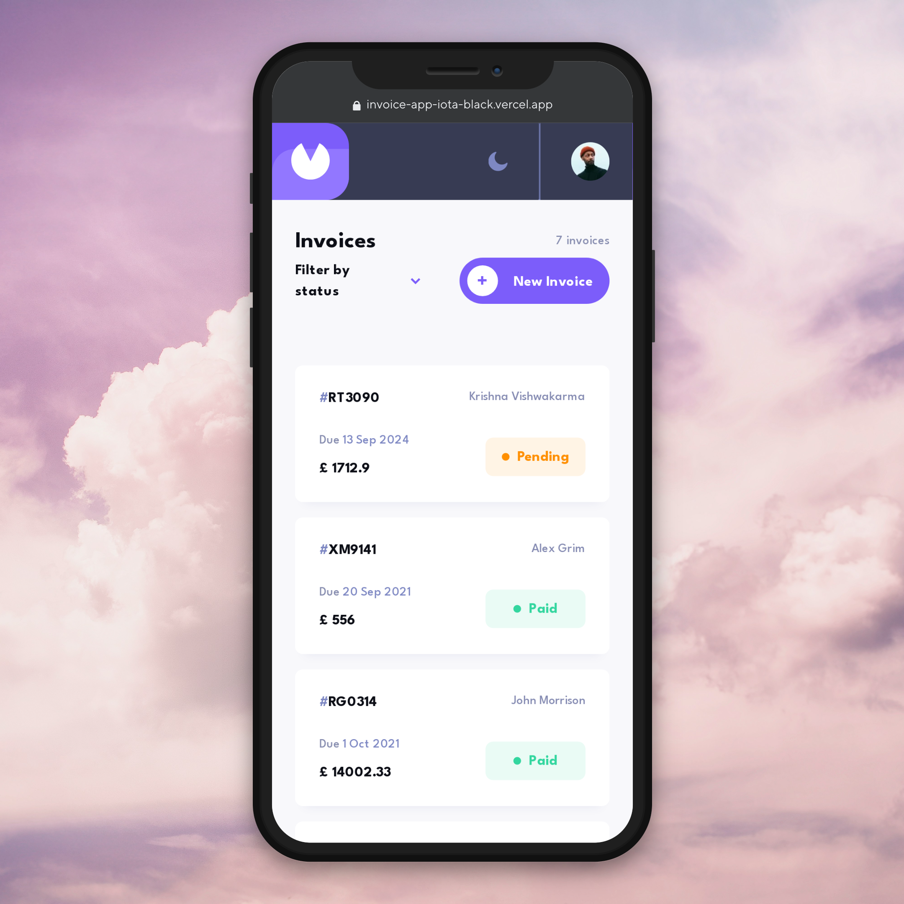
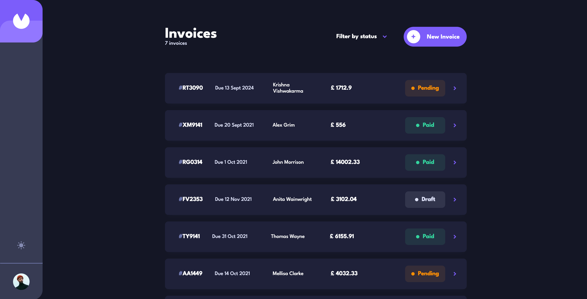
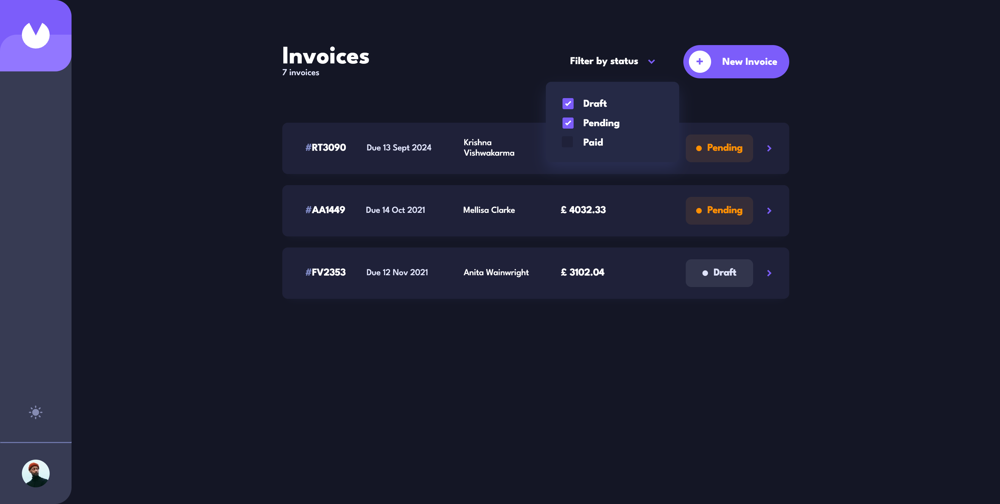
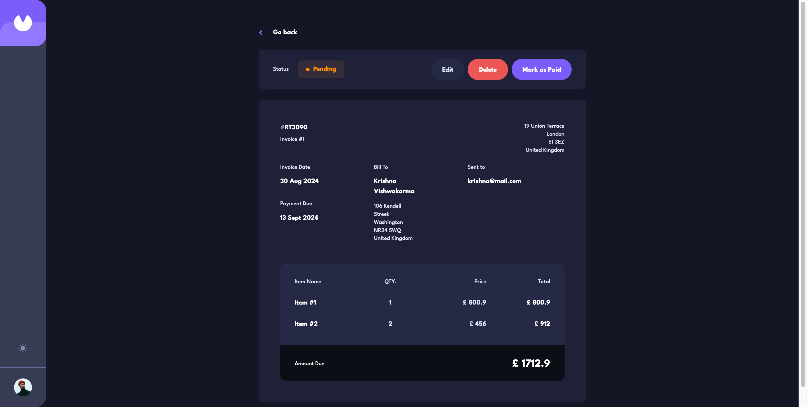

# Frontend Mentor - Invoice app solution

This is a solution to the [Invoice app challenge on Frontend Mentor](https://www.frontendmentor.io/challenges/invoice-app-i7KaLTQjl). Frontend Mentor challenges help you improve your coding skills by building realistic projects. 

## Welcome! 👋, Table of contents

- [Overview](#overview)
  - [The challenge](#the-challenge)
  - [Screenshot](#screenshot)
  - [Links](#links)
- [My process](#my-process)
  - [Built with](#built-with)
  - [What I learned](#what-i-learned)  
  - [Useful resources](#useful-resources)
- [Author](#author)

## Overview

### The challenge

Users is be able to:

- View the optimal layout for the app depending on their device's screen size
- See hover states for all interactive elements on the page
- Create, read, update, and delete invoices
- Receive form validations when trying to create/edit an invoice
- Save draft invoices, and mark pending invoices as paid
- Filter invoices by status (draft/pending/paid)
- Toggle light and dark mode

### Screenshot

### Links

- Solution URL: [Solution URL](https://www.frontendmentor.io/solutions/responsive-contact-form-solution-FCWxWshwXQ)
- Live Site URL: [Live URL](https://invoice-app-iota-black.vercel.app/)

## My process

### Built with

- Semantic HTML5 markup
- CSS custom properties
- Flexbox
- CSS Grid
- Mobile-first workflow
- [React JS](https://reactjs.org/) - JS library
- [Typescript](https://www.typescriptlang.org/)
- [Node JS](https://nodejs.org/) - Backend Server
- [Express JS](https://expressjs.com/) - For Backend API
- [Mongo DB](https://www.mongodb.com/) - For Datebase
- [Vercel](https://vercel.com/) - For Deployment

### What I learned

- Writing Semantic HTML5 markup
- CSS Flexbox & Grids
- Mobile-first workflow
- JS Form Validatio
- Gained more experience with building reusable UI components, managing state with hooks, and working with props
- Improved app performance through effective component rendering and lifecycle management
- Ensured type safety and reduced bugs by implementing static types
- Created a robust backend to handle API requests, manage server-side logic, and route different endpoints
- Learned how to work with middleware, and how to structure and secure routes effectively
- Learned NoSQL database structure and how to create, read, update, and delete (CRUD) operations efficiently
- Learned schema design for flexible data models and how to handle data relationships
- Utilizing Vercel’s continuous integration and delivery (CI/CD) for fast and secure releases of Streamlined deployment process
- Optimized the app for production, handling environment variables and configuration

### Useful resources

- [Rest API with Express, Node and Mongo DB](https://www.mongodb.com/resources/languages/express-mongodb-rest-api-tutorial) - Helped me to write API efficiently
- [Mongoose Mongo DB Schema](https://mongoosejs.com/docs/guide.html) - Helped me to understand what is Schema and how to write Schema for DB handling with correct data
- [React App  with Node JS Backend](https://www.freecodecamp.org/news/how-to-create-a-react-app-with-a-node-backend-the-complete-guide/)

## Author

- Frontend Mentor - [@KrishnaVishwakarma1595](https://www.frontendmentor.io/profile/KrishnaVishwakarma1595)
- Codewars - [@krish_codewars_797](https://www.codewars.com/users/krish_codewars_797)